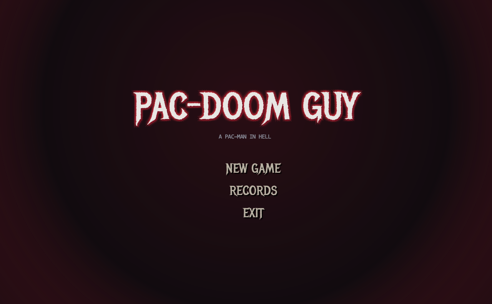
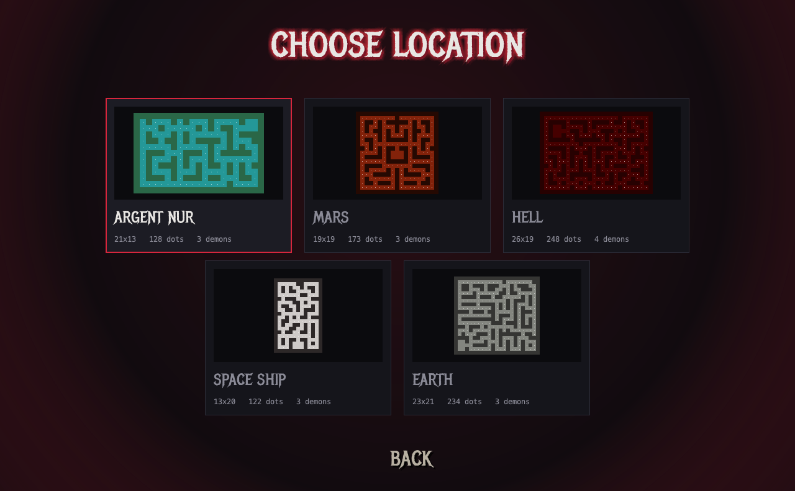
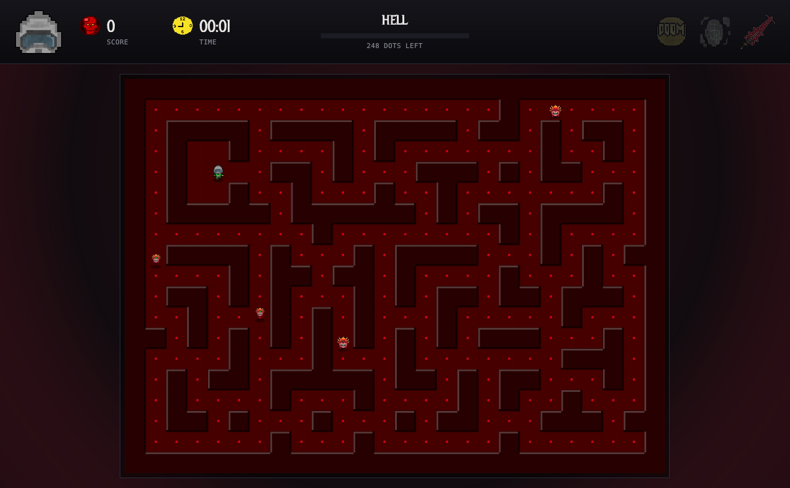
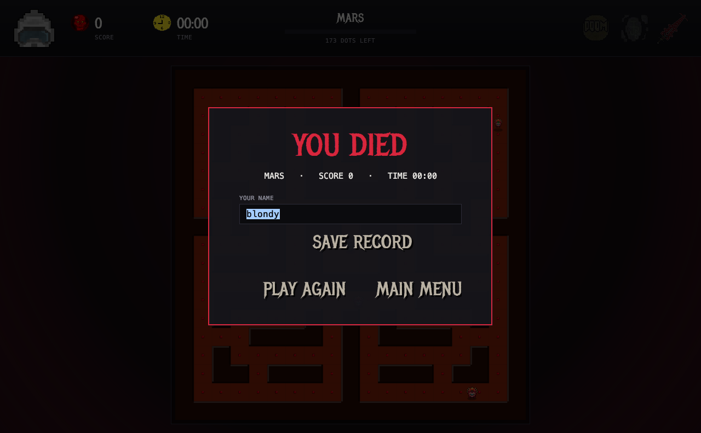

# Pac-Doom Guy

A Pac-Man style arcade game in a DOOM setting. Pure Java 21 + Swing, no runtime dependencies.



| Level select | In game | Results |
|---|---|---|
|  |  |  |

## Gameplay

- Five hand-made mazes (Argent Nur, Mars, Hell, Space Ship, Earth), each with its own palette.
- Collect every dot to clear the level; demons roam the maze and occasionally chase you.
- Demons drop power-ups: **shield** (immune for 5 s), **rune** (speed boost for 10 s) and
  **blade** (touching a demon kills it for 10 s, +10 score). Pick-ups expire if ignored.
- Four lives, respawn invulnerability, pause, and a persistent hall of fame.

Controls: `WASD` / arrows to move, `ESC` / `P` to pause, `R` restart and `M` menu while paused.
Menus are fully keyboard navigable.

## Run

Requires **Java 21 or newer** ([download from Oracle](https://www.oracle.com/java/technologies/downloads/)). Nothing else - the Maven wrapper
downloads Maven itself on first run.

```bash
git clone https://github.com/evgenwwh/Pac-Doom-Guy.git
cd Pac-Doom-Guy
./mvnw package          # runs the tests and builds target/pac-doom-guy.jar
java -jar target/pac-doom-guy.jar
```

On Windows use `mvnw.cmd package` instead of `./mvnw package`.
`./mvnw exec:java` launches straight from sources without building the jar.

## Architecture

```
com.evgenwwh.pacdoomguy
├── App                 entry point
├── model/              pure game logic, no Swing, no threads
│   ├── GameSession     rules of one play-through: ticks, score, lives, effects, win/lose
│   ├── Level, Levels   immutable tile grids + validation (spawns, enclosure)
│   ├── Entity          AABB movement with Pac-Man style lane locking and cornering
│   ├── Player, Demon   the characters; Demon AI = wander + 35 % chance to chase
│   └── item/Item, Effect
├── stats/              Record + RecordsRepository (plain text file in ~/.pac-doom-guy)
└── ui/                 Swing layer
    ├── MainWindow      one JFrame, CardLayout of screens
    ├── GameScreen      60 Hz javax.swing.Timer loop, Graphics2D rendering, HUD, overlays
    ├── LevelRenderer   cached maze background with bevelled walls, scaled to fit any window
    └── Menu / LevelSelect / Records screens, Theme, Sprites, DoomButton
```

Design points worth noting:

- **Model / view separation.** `GameSession.update()` advances the simulation one tick and knows
  nothing about rendering, so the whole rule set is covered by fast JUnit tests
  (`./mvnw test`).
- **Single-threaded game loop.** Everything runs on the Swing EDT driven by one timer; there is
  no shared mutable state between threads.
- **Resolution independent.** The maze is drawn through an `AffineTransform`, so the game fits
  a 960×640 window as well as a 4K display.
- **Zero dependencies.** Only the JDK at runtime; JUnit 5 for tests.

## Credits

- Display font: [Metal Mania](https://fonts.google.com/specimen/Metal+Mania) by Open Window,
  SIL Open Font License 1.1 (see `src/main/resources/fonts/OFL.txt`).
- Sprites are the original ones drawn for the first version of this project.

## History

This started as one of my first Java projects. The original version had the game logic spread
over ~10 background threads, a 1920×1080 hard-coded window, a `JPanel` per maze cell and win
conditions hard-coded per level (one of them was even off by 58 dots). This rewrite keeps the
original sprites and level layouts but rebuilds the code around a testable model.
